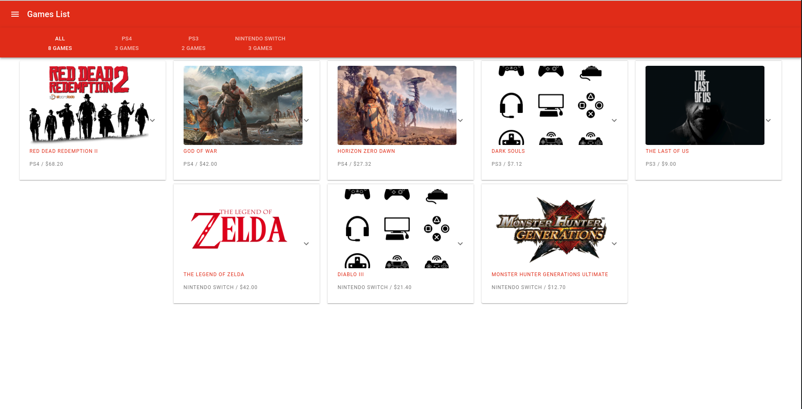
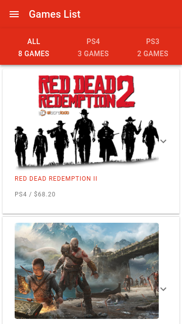
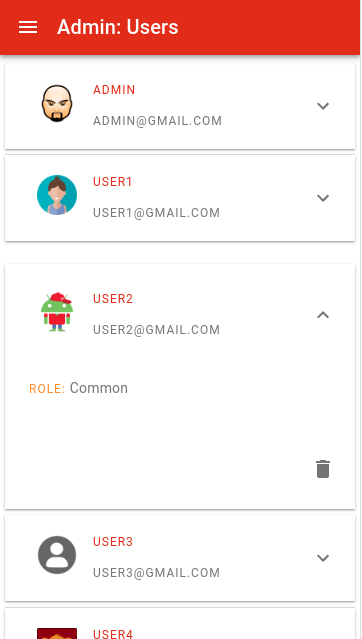

# Games Store

Project for IPP/ESTG Class "Segurança em Aplicações Web"

## Components

* [Backend](/backend) - Backend web service made in PHP.
* [Frontend](/frontend) - Frontend made in Javascript (ReactJS).

## Objectives

* The app was created to maintain a list of games sold by users.
* The main purpose is to avoid security problems in application, specially about validation, sanitization, unauthorized access of files and resources, password cracking etc.

## Built With

* [Docker](https://www.docker.com/) - Deploy applications using containers.

## Screenshots

## Live

Live version is not available yet.

## Authors

* **Célio Ighour** - *Owner* - [Ighour](https://github.com/ighour)
* **Simona Alecs** - *Developer*