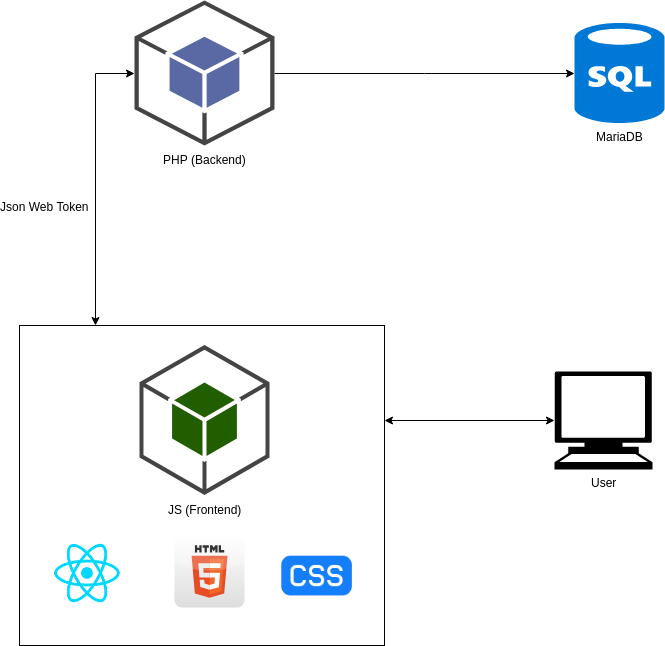

# Games Store

Project for [IPP/ESTG](https://www.estg.ipp.pt/) class "Segurança em Aplicações Web" (Web Application Security).

## Main Components

- **[Backend](https://github.com/ighour/games-store-be)** - web service made in PHP with my own MVC framework.
- **[Frontend](https://github.com/ighour/games-store-fe)** - made in Javascript (ReactJS).

## Objectives

* The app was created to maintain a list of games sold by users.
* The main purpose is to avoid security problems in application, specially about validation, sanitization, unauthorized access of files and resources, password cracking etc.

## Screenshots

**Games List - Common**


**Games List - Mobile**


**Users List - Mobile**


## Built With

* [Docker](https://www.docker.com/) - Deploy applications using containers.
* [MariaDB](https://mariadb.org/) - SQL database.
* [phpMyAdmin](https://www.phpmyadmin.net/) - Intuitive web interface to access database.

## Modelling

**Application Architecture**



## Installation

This installation guide uses *[Docker-Compose](https://docs.docker.com/compose/)* to run applications. If you want to install with another method, you need to configure your environment to correctly run the PHP application, connected to a SQL Database, and the JS application.

#### 1. Clone project

#### 2. Get Submodules (backend and frontend)
```script
git submodule init
git submodule update
```

#### 3. Configure backend .env

* **HEADER_ACCESS_CONTROL_ALLOW_ORIGIN** - Allowed request origins. Here will be the address of frontend application (e.g. http://localhost:8001). Or you can just put * to allow all origins.

* **DATABASE_HOST** - Address of database (e.g. 127.0.0.1).
* **DATABASE_NAME** - Database name (e.g. mydatabase).
* **DATABASE_USER** - Database user (e.g. user).
* **DATABASE_PASSWORD** - Database user password (e.g. password).

* **JWT_KEY** - A random hash with good length (e.g. asud832que9jSAde32e081DSAIJwqre321r1sDqq324e1).
* **JWT_EXPIRE** - Time before JWT expires, in miliseconds (e.g. 3600000).

* **MAILER_HOST** - Valid mailer host and fallback host to send emails (e.g. smtp1.example.com;smtp2.example.com).
* **MAILER_USERNAME** - Mailer username (e.g. user).
* **MAILER_PASSWORD** - Mailer password (e.g. password).
* **MAILER_SECURE** - Mailer secure type (e.g. tls).
* **MAILER_PORT** - Mailer port (e.g. 587).

#### 4. Configure frontend .env

* **REACT_APP_API_URL** - Address of backend with slash at end (e.g. http://localhost:80/).
* **REACT_APP_API_DEFAULT_AVATAR_PATH** - Relative path of default user avatars on backend (e.g. img/avatar.png).
* **REACT_APP_API_DEFAULT_GAME_PATH** - Relative path of default game images on backend (e.g. img/game.png).

*If you change default path of images, you need to put desired path into backend folder (/app/public/img...).*

#### 5. Install dependencies

* For backend, you need to install dependencies with composer. Use *composer install -o* on backend folder (or run the file *docker-composer.sh* to open a container with composer and run the same command inside it).

* For frontend, you need to install dependencies with npm (or similar). Use *npm install* on frontend folder (or run the file *docker-npm.sh* to open a container with node and run the same command inside it).

#### 6. Migrate backend database

* Run the *migrate.sql* file in backend/db folder on your SQL database.

#### 7. Run backend seeds

* Run the *seed.sql* file in backend/db folder on your SQL database.

#### 8. Build project with Docker-Compose

* *docker-compose build*

#### 9. Deploy with Docker-Compose

* *docker-compose up*

#### 10. Default ports for applications

* **Backend** (PHP): 8000

* **phpMyAdmin**: 8001

* **Frontend** (ReactJS): 8002

* **Frontend** (Builded ReactJS): 8003

## Reports

A full report of this project is available in portuguese [here](./sample/report.pdf).